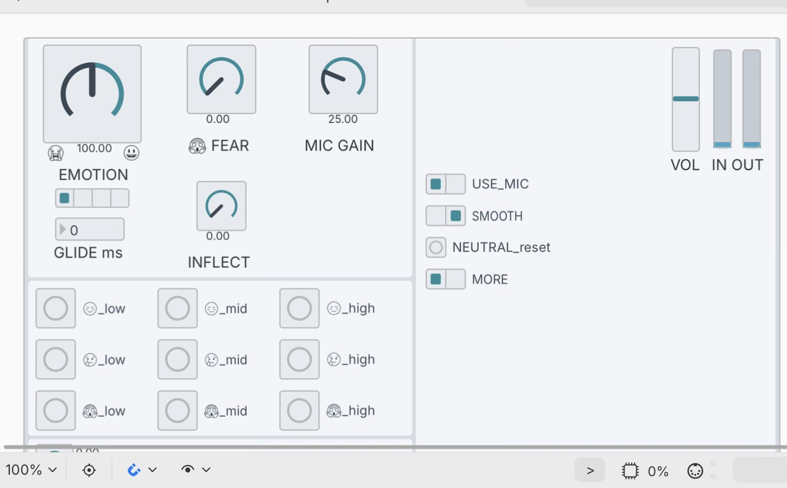

# Vocal emotion feedback

Live sad / happy / afraid voice effect for plugdata (iOS). Based on Rachman et al. 2018 (DAVID) and Aucouturier et al. 2016. Independent re-implementation, not endorsed by the authors. Live effect, requires wired headphones, preferably closed-back or noise-cancelling.

## Files
- `vocal-emotion-feedback.pd` - the patch for plugdata (uses ELSE `knob`)
- `vocal-emotion-feedback-desktop.pd` - same patch for vanilla Pure Data (the five knobs are sliders)
- `panel-plugdata.jpg` - the panel in plugdata
- `panel-desktop.png` - the panel, desktop version
- `LICENSE` - MIT

## Use
1. Put `vocal-emotion-feedback.pd` in plugdata's folder and open it.
2. DSP on, run mode.
3. Tick USE_MIC.
4. With a noisy mic, raise GATE until the hiss stops.

Requires these objects (all vanilla Pd): `sigmund~` `expr` `expr~` `fexpr~` `samphold~` `rzero~` `vline~` `delread4~` `biquad~`. The plugdata file also needs ELSE `knob` (bundled with plugdata, ELSE 1.0-0 RC9 or newer). If `sigmund~` is missing, turn SMOOTH off.

## Todo

### First
- Add explanations for these 
- Voicing-aware window freeze (freeze last good window on low confidence / pitch=0, gentle crossfade on re-lock)
- Delay-time slew limiter (~1–2 oct/s max)
- Unique `$0` prefix on all `vfb-` names
- Soft-knee expander instead of hard gate

### Then
- Adaptive onset detector (noise-floor threshold + hold-off)
- Table-driven inflection envelope (replace long breakpoint message)
- Continuous emotion→cents curves + global Intensity control
- Fix long-glide deviation (>500 ms)

### After that
- Pre-emphasis shelf for pitch tracker only
- Restore last preset on load
- Extra diagnostics (voicing confidence, window length)
- Dynamic opposing shelf for basic formant compensation (controlled by current cents)
- Optional mild amplitude modulation with the vibrato

## Structure
Below the panel, out of view, each stage is a subpatch: `live_input`, `window_length`, `delay_line`, `delay_tap_1`, `delay_tap_2`, `high_shelf`, `output` and others. The audio path runs along the top row. Control values travel by name (prefix `vfb-`). Audio stays on wires.

## Controls
| Control | Function |
|---|---|
| EMOTION | left sad, centre neutral, right happy |
| FEAR | afraid vibrato, 8.5 Hz, up to +-40 cents |
| INFLECT | pitch swoop at phrase start, 0 = off (default) |
| Presets | NEUTRAL, HAPPY / SAD / AFRAID at low / mid / high |
| MIC GAIN | 25 = unity |
| VOL | fader, default 50, output clipped at +-0.95 |
| GATE 0=off | 0 = off, 1-100 = -69.5 to -20 dBFS |
| GLIDE ms | 0 = jump |
| USE_MIC | mic on |
| SMOOTH | on (default): shifter window follows the pitch period (about 20 ms). off: fixed 10 ms |
| NEUTRAL_reset | button, resets to no effect |
| MORE | RECORD_(may_fail), SHELF_2nd-order, FEMALE_VOICE, SMALLER_PITCH, PAPER_LEVELS, AFRAID_SWOOP_150ms, AFRAID_SWOOP_SIZE |

## Parameters
| | Pitch (cents) | High band above 8 kHz | Other |
|---|---|---|---|
| Happy low / mid / high | about +30 / +41 / +50 | up to about +9.5 dB/oct | inflection -200..+140 cents, 500 ms |
| Sad low / mid / high | about -40 / -56 / -70 | down to about -12 dB/oct | |
| Afraid | | | vibrato 8.5 Hz, 30% rate spread |

The high band is approximated by a 5th-order Butterworth shelf.

## Where the numbers come from
The presets follow DAVID (Rachman et al. 2018, Table 2), not the original 2016 experiment (Aucouturier et al.). The 2016 study used a hardware processor, then a Max/MSP port, with different values: pitch +25 cents happy / -30 sad, happy inflection starting at -50 cents (400 ms), afraid vibrato 15 cents deep, happy compression, a sad formant shift (ratio 0.9) and 2nd-order shelves, with the effects ramped in over 5 minutes. This patch has no compression, formant shift or slow ramp.

| Setting | Source |
|---|---|
| Happy / Sad low, mid, high buttons | DAVID Table 2: +29.5 / +40.9 / +50.0 and -39.8 / -56.2 / -70.0 cents |
| Afraid low, mid, high buttons | DAVID Table 2: vibrato depth 26 / 34 / 40 cents (male), 13.7 / 20.2 / 33.0 (FEMALE_VOICE) |
| PAPER_LEVELS | happy inflection depth from DAVID Table 2 (-145 / -159 / -200 cents) instead of a linear scale |
| AFRAID_SWOOP_SIZE | afraid inflection size from DAVID Table 2 (male and female values) instead of a full +-200 cents |
| SMALLER_PITCH | this patch only: happy up to +30, sad down to -50 cents |

Caveats from the papers: in DAVID, recognition was above chance but modest (about 33-39% raw against 20% chance), the afraid effect is often heard as sad, and a stronger setting is less natural. The happy effect did not sound more intense at higher settings.

## Latency (roughly)
| Setting | Delay |
|---|---|
| SMOOTH off | about 5 ms |
| SMOOTH on | about 10 ms |

Only the shifter delay line adds delay: half the window, with no extra fixed offset. plugdata's audio buffers are additional.

## Console
Printed once a second:
| Line | Meaning |
|---|---|
| `mic_in_dB`, `after_gain_dB`, `out_dB` | raw mic, after USE_MIC and MIC GAIN, final output (100 = full scale) |
| `pitch_Hz` | tracked pitch, 0 = none |
| `window_ms` | shifter window |
| `shift_cents` | total pitch shift being applied (preset level plus vibrato and inflection) |
| `delay_ms` | shifter delay, window / 2, plugdata's buffers not included |

Tap a preset and read `shift_cents` and `delay_ms` to check the numbers in the tables above.

## Tested
Desktop Pd 0.54.1 with test tones and a file standing in for the mic: pitch, shelf gain, inflection, latency, gate, clipping and presets. The desktop file loads with no errors. Live on iPad with a USB headset.

## Known issues
- GLIDE deviates for about 0.5 s with a 2000 ms ramp.
- RECORD fails on iOS outside plugdata's folder.
- plugdata on iOS has no input chooser.
- Shared names use a fixed prefix, so two copies open at once interfere. Open one.

## Credits
- Rachman, Liuni, Arias, Lind, Johansson, Hall, Richardson, Watanabe, Dubal, Aucouturier. DAVID: An open-source platform for real-time transformation of infra-segmental emotional cues in running speech. Behavior Research Methods 50:323-343 (2018). DOI 10.3758/s13428-017-0873-y. CC BY 4.0. The preset values (Table 2), the algorithm descriptions and the caveats in this README are taken or adapted from this paper.
- DAVID software, github.com/neuro-team-femto/david. MIT, Copyright (c) 2015 CNRS UMR 9912 STMS / IRCAM.
- Aucouturier, Johansson, Hall, Segnini, Mercadié, Watanabe. Covert digital manipulation of vocal emotion alter speakers' emotional states in a congruent direction. PNAS 113(4):948-953 (2016). DOI 10.1073/pnas.1506552113. The 2016 values quoted above are from the paper and its Supporting Information.
- Pure Data, plugdata, ELSE, Cyclone.

## Licence
MIT.
